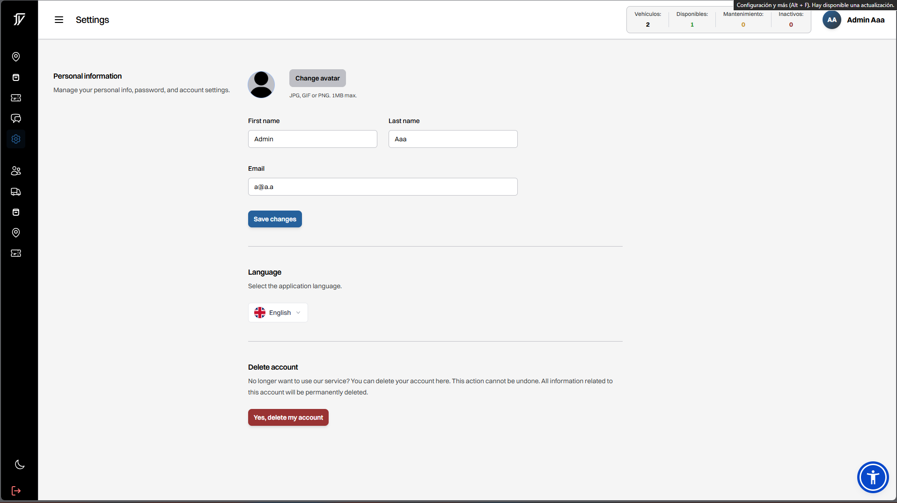
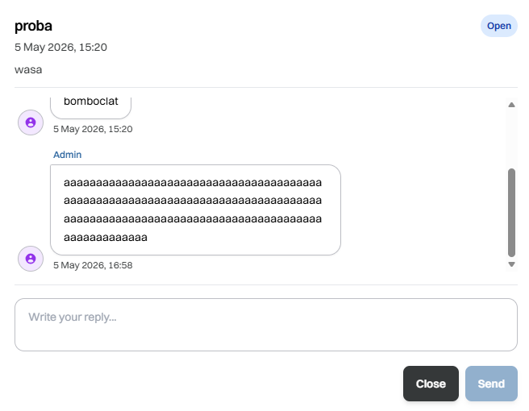

## Llista de bugs

1. Arreglat -- Ja no apareix el error visual -- Hi ha un error visual a l'apartat de configuració, on els requadres de text no son visibles. Aixo es degut al tema del navegador, ja que només passa si el tenim en mode fosc.

ABANS:

ARA:

2. Arreglat -- Ja no apareix el boto de "cancelar reserva" al mapa -- Al mapan en prémer al vehicle apareix el botó de “cancelar reserva”, tot i que no hem reservat cap vehicle encara.

3. Parcial -- Ja no surt la rodona del geofencing -- Dintre de la rodona del geofencing, pots clicar a qualsevol lloc i apareix un petit requadre amb informacio del vehicle.

4. Arreglat -- Ja hem traduit tots els missatges de error -- Alguns missatges d’errors no estan ben traduits

5. Arreglat -- Ja apareix el vehicle com a reservat -- Quan crees una reserva, el vehicle no apareix com a reservat i et deixa emplenar el formulari de reserva de forma infinita (desconec si els administradors han d’acceptar la reserva manualment)

6. Arreglat -- Era un error de una imatge que no tenia que existir -- La icona de “Mark” a l’apartat de geocencing no carrega

7. Arreglat -- Ja no es trenca la interfície quan enviem un missatge de soport llarg -- Si enviem un missatge de soport llarg, la interfície es trenca.

ABANS:

ARA:

## Llista de funcionalitats no implementades

Sistema de reserves (tenen placeholders, falta al backend)
No hi ha chatbot.
No hi ha seeders

Hem implementat el sistema de reserves, ja que es una funcionalitat bàsica per a l'aplicació. Ara els usuaris poden reservar vehicles i els administradors poden veure les reserves realitzades.
També hem implementat el chatbot, que permet als usuaris enviar missatges de suport i rebre respostes automàtiques. Això millora l'experiència de l'usuari i facilita la comunicació amb el suport tècnic.

## Llista de millores d’usabilitat

Implementat -- Mode fosc, ja que solucionaria l’error del text no visible
Implementat -- Hem fet que al mapa nomes et sortiguen els vehicles disponibles al moment, o en cas de reservar un vehicle nomes et sortigue aquell vehicle -- Al mapa, afegir icones per a veure l’estat del vehicle.
Implementat -- Amagar el botó de reservar si el vehicle no esta disponible
Implementat -- Al registre, millorar els caracters obligatoris en el camp de contrasenya, ja que actualment no et demana ni majúscules ni numeros.

## ADMIN

Pendent -- En el formulari de crear nou vehicle, l’administrador ha de posar manualment la ubicació i latitud del vehicle. Crec que sería mes senzill que es pugui seleccionar directament al mapa. Passa igual amb el camp de “color del vehicle”.

Pendent -- En iniciar sessió com administrador, aquest veu també l’apartat de client (es a dir, pot reservar vehicles, enviar tickets de soport (a ell mateix)). Fa falta revisar els rols de cada usuari.

## TENNANT

Pendent -- Un cop fas login com a tennant, no hi ha cap secció a la sidebar, però si recarregues la pagina apareixen 

Arreglat -- En el formulari de crear nou tennant, els camps de validació de contrasenya apareixen en format de error com a notificació per detras del formulari un cop cliques a crear tennant. Seria mes senzill fer la validació mentres escrius per veure el que et demana.

Arreglat --Apareix un missatge d’error en crear el tennant, tot i que realment si es crea i apareix a la base de dades.

