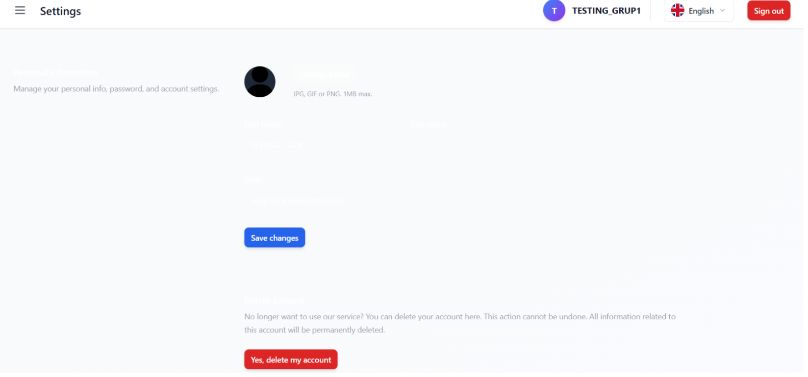
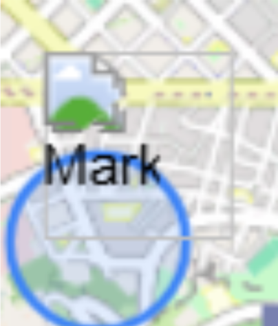
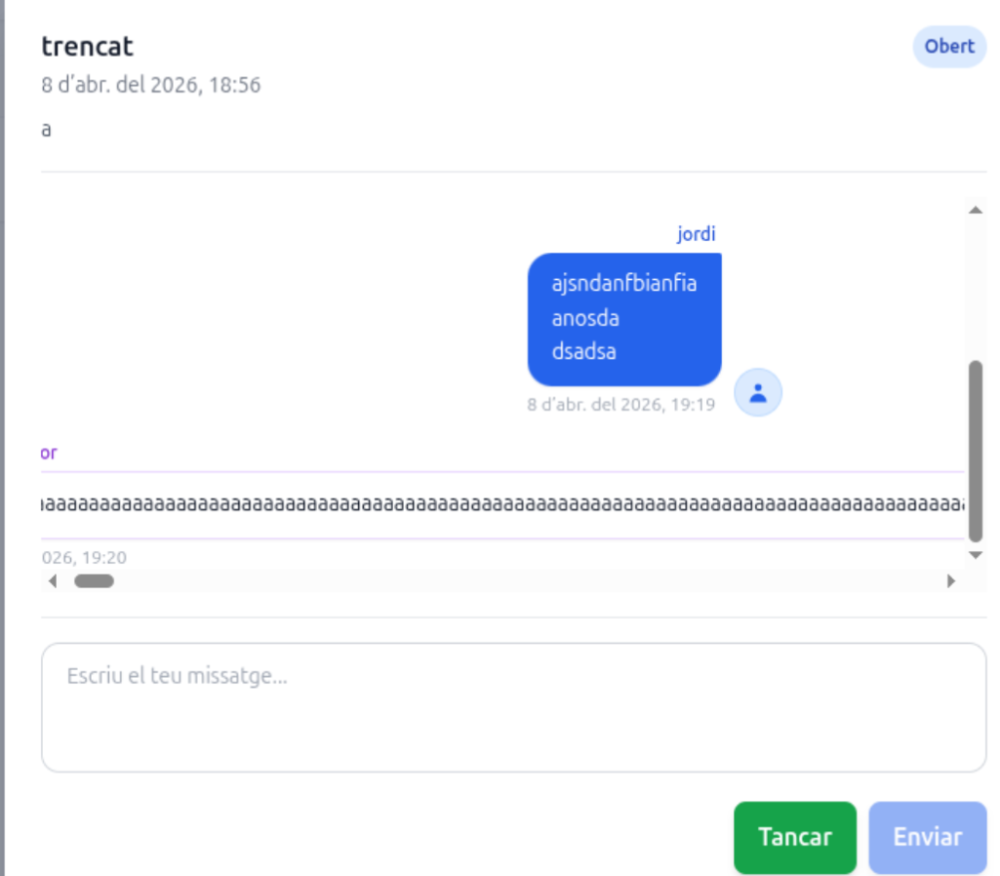
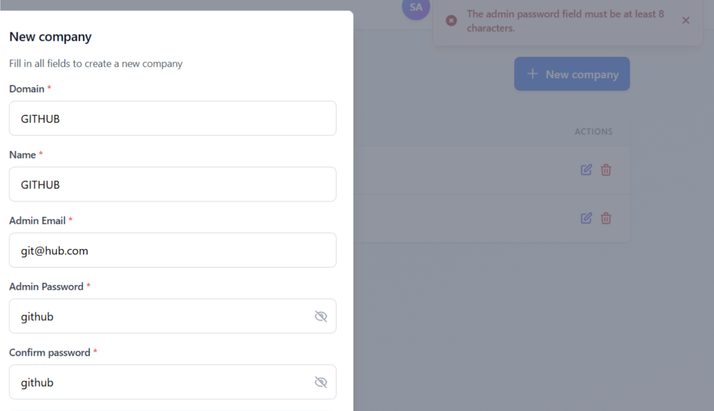
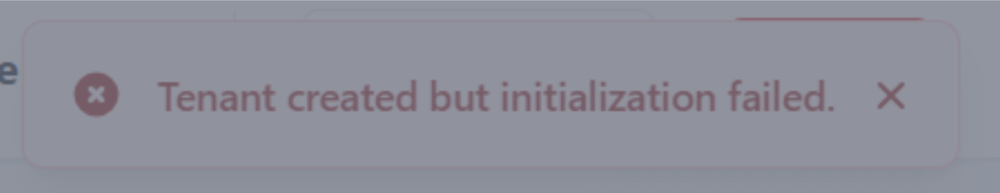

## Llista de bugs

1. Hi ha un error visual a l'apartat de configuració, on els requadres de text no son visibles. Aixo es degut al tema del navegador, ja que només passa si el tenim en mode fosc.

2. Al mapa, en prémer al vehicle apareix el botó de “cancelar reserva”, tot i que no hem reservat cap vehicle encara.

3. Dintre de la rodona del geofencing, pots clicar a qualsevol lloc i apareix un petit requadre amb informacio del vehicle.

4. Alguns missatges d’errors no estan ben traduits

5. Quan crees una reserva, el vehicle no apareix com a reservat i et deixa emplenar el formulari de reserva de forma infinita (desconec si els administradors han d’acceptar la reserva manualment)

6.  La icona de “Mark” a l’apartat de geocencing no carrega

7.  Si enviem un missatge de soport llarg, la interfície es trenca.

## Llista de funcionalitats no implementades

Sistema de reserves (tenen placeholders, falta al backend)
No hi ha chatbot.
No hi ha seeders

## Llista de millores d’usabilitat

Mode fosc, ja que solucionaria l’error del text no visible
Al mapa, afegir icones per a veure l’estat del vehicle.
Amagar el botó de reservar si el vehicle no esta disponible
Al registre, millorar els caracters obligatoris en el camp de contrasenya, ja que actualment no et demana ni majúscules ni numeros.

## ADMIN

En el formulari de crear nou vehicle, l’administrador ha de posar manualment la ubicació i latitud del vehicle. Crec que sería mes senzill que es pugui seleccionar directament al mapa. Passa igual amb el camp de “color del vehicle”.

En iniciar sessió com administrador, aquest veu també l’apartat de client (es a dir, pot reservar vehicles, enviar tickets de soport (a ell mateix)). Fa falta revisar els rols de cada usuari.

## TENNANT

Un cop fas login com a tennant, no hi ha cap secció a la sidebar, però si recarregues la pagina apareixen 

En el formulari de crear nou tennant, els camps de validació de contrasenya apareixen en format de error com a notificació per detras del formulari un cop cliques a crear tennant. Seria mes senzill fer la validació mentres escrius per veure el que et demana.

Apareix un missatge d’error en crear el tennant, tot i que realment si es crea i apareix a la base de dades.

